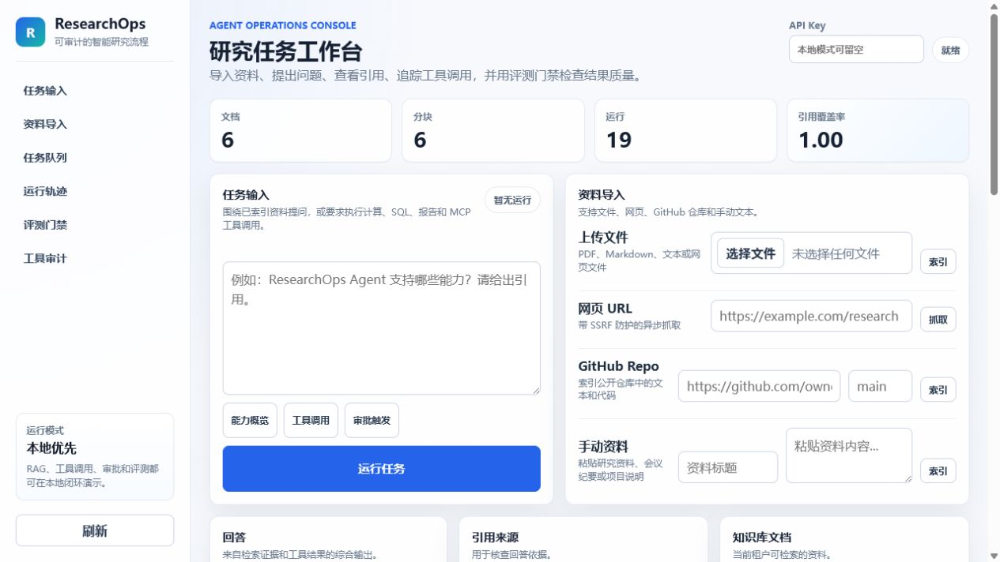
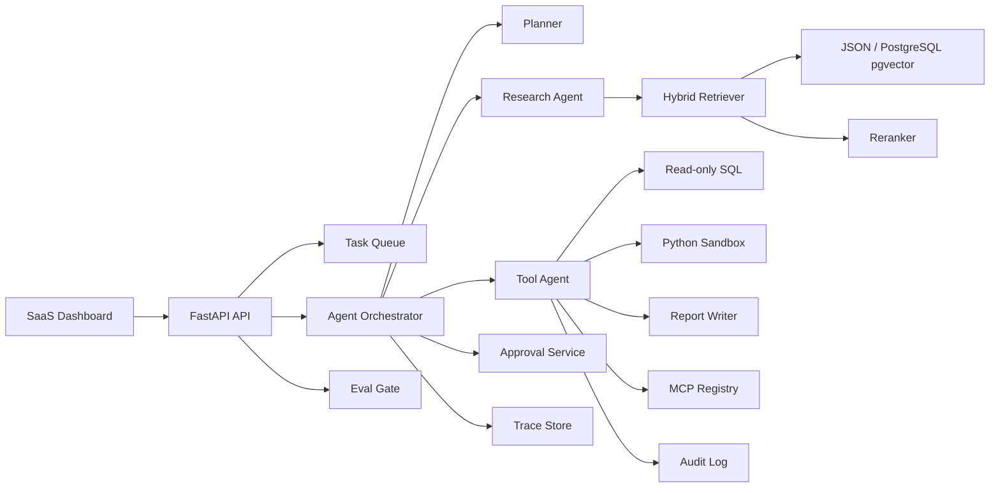

# ResearchOps Agent

Local-first AI research workflow console with RAG, citations, tool calls,
human approval gates, trace timelines, task queues, audit logs, and eval gates.



## Why It Exists

ResearchOps Agent is built for research workflows that need more than a chat box.
It turns document ingestion, grounded answering, tool execution, approval, and
quality checks into one auditable agent workspace.

## Highlights

- **Grounded RAG answers** with citations and source locators.
- **Multi-source ingestion** for text, PDFs, URLs, and GitHub repositories.
- **Planner + tool agent flow** for calculations, SQL, sandboxed Python, reports,
  MCP calls, and knowledge stats.
- **Structured planning details** with stage, risk, confidence, tool hints, and
  approval requirements returned to the UI.
- **Human-in-the-loop approval** for risky actions.
- **Trace, task, and audit visibility** across agent runs and tool calls, with
  task cancel/retry/recovery controls and filtered audit replay.
- **Fixture-backed eval gate** for citations, safety behavior, retrieval, tools,
  observability, and missing-context handling.
- **Local-first runtime** with JSON fallback, optional OpenAI Agents SDK, and
  PostgreSQL + pgvector as the Docker production path.

## Architecture



## Agent Lifecycle

```text
created -> planner -> tool_agent? -> rag_research -> awaiting_approval | completed
```

Async work uses task records:

```text
queued -> running -> completed | failed | canceled
```

## Quick Start

### Local API + dashboard

```powershell
cd C:\Users\lenovo\Desktop\AGENT\researchops-agent
.\.venv\Scripts\python.exe -m pip install -e ".[dev]"
.\.venv\Scripts\python.exe scripts\seed_demo_data.py
.\.venv\Scripts\python.exe -m uvicorn app.main:app --host 127.0.0.1 --port 8000
```

Open:

```text
http://127.0.0.1:8000/
```

### Docker Compose

```powershell
Copy-Item .env.example .env
docker compose up --build
```

Open:

```text
http://localhost:8000/
```

## Ingestion

The dashboard supports:

- File upload: `.pdf`, `.txt`, `.md`, `.html`, `.csv`
- URL ingestion with SSRF protections
- GitHub repository ingestion from `https://github.com/{owner}/{repo}`
- Manual text ingestion

GitHub repository ingestion downloads the public repository archive, extracts
supported text/code files, chunks them, and indexes the result into the knowledge
store.

## Runtime Configuration

Default local mode:

```env
STORE_BACKEND=auto
EMBEDDING_PROVIDER=local
AGENT_RUNTIME=auto
TASK_BACKEND=local
```

OpenAI-backed mode:

```env
OPENAI_API_KEY=...
EMBEDDING_PROVIDER=openai
AGENT_RUNTIME=openai_agents
```

Celery/Redis task mode:

```env
TASK_BACKEND=celery
REDIS_URL=redis://redis:6379/0
```

Docker Compose runs the API and worker with:

```env
STORE_BACKEND=postgres
TASK_BACKEND=celery
```

Local development still defaults to `STORE_BACKEND=auto`, which uses PostgreSQL
when reachable and falls back to the JSON store when it is not.

Start worker:

```powershell
celery -A app.worker.celery_app worker --loglevel=INFO
```

## Safety Boundaries

- API keys and local password users can create bearer sessions.
- Users map to role, tenant, and source allowlists.
- Documents, runs, traces, approvals, tasks, eval summaries, and audits are
  tenant-scoped.
- URL ingestion only allows `http`/`https`, rejects embedded credentials, blocks
  private/reserved/localhost/link-local addresses, and validates redirects.
- Tool calls are assigned risk levels and written to an audit log.
- Mutating/destructive intent is routed to human approval.
- Python execution uses a restricted subprocess by default and supports Docker
  isolation for stronger boundaries.

Example auth configuration:

```env
API_KEYS_JSON=[{"key":"admin-key","user_id":"admin","tenant_id":"acme","role":"admin"}]
LOCAL_USERS_JSON=[{"user_id":"admin","password":"secret","tenant_id":"acme","role":"admin"}]
```

Create a session:

```powershell
Invoke-RestMethod `
  -Uri http://localhost:8000/api/auth/login `
  -Method Post `
  -ContentType "application/json" `
  -Body '{"api_key":"admin-key"}'
```

Docker sandbox mode:

```env
SANDBOX_MODE=docker
SANDBOX_DOCKER_IMAGE=python:3.12-slim
SANDBOX_MEMORY=128m
SANDBOX_CPUS=0.5
```

MCP example server:

```env
MCP_SERVERS_JSON=[{"name":"example","command":"python","args":["scripts/example_mcp_server.py"]}]
MCP_ALLOWED_TOOLS_JSON={"example":["echo","add","search_fixture","status"]}
```

User management endpoints for admins:

- `GET /api/users`
- `POST /api/users`
- `DELETE /api/users/{user_id}`

System and operations endpoints for admins/editors:

- `GET /api/system/config`
- `POST /api/system/tasks/recover`
- `POST /api/tasks/{task_id}/cancel`
- `POST /api/tasks/{task_id}/retry`
- `GET /api/audit?risk_level=&status=&target=&run_id=`
- `GET /api/audit/replay/{run_id}`

## Quality Gates

```powershell
.\.venv\Scripts\python.exe -m ruff check .
.\.venv\Scripts\python.exe -m pytest -q
.\.venv\Scripts\python.exe scripts\run_eval_gate.py
```

Current local verification:

```text
compileall: passed
eval gate: pass_rate=1.0, citation_correctness=1.0
MCP stdio smoke test: passed
```

Validate PostgreSQL + pgvector when Docker Compose is running:

```powershell
.\.venv\Scripts\python.exe scripts\validate_postgres_store.py
```

## API Surface

- `POST /api/ingest`
- `POST /api/auth/login`
- `GET /api/auth/me`
- `GET /api/users`
- `POST /api/users`
- `DELETE /api/users/{user_id}`
- `POST /api/ingest/text`
- `POST /api/ingest/text/async`
- `POST /api/ingest/url`
- `POST /api/ingest/url/async`
- `POST /api/ingest/github/async`
- `GET /api/documents`
- `POST /api/ask`
- `GET /api/runs/{run_id}/trace`
- `GET /api/tasks`
- `POST /api/tasks/{task_id}/cancel`
- `POST /api/tasks/{task_id}/retry`
- `GET /api/audit`
- `GET /api/audit/replay/{run_id}`
- `GET /api/system/config`
- `POST /api/system/tasks/recover`
- `GET /api/approvals`
- `POST /api/approvals/{approval_id}/decision`
- `GET /api/eval/summary`
- `POST /api/eval/run`
- `POST /api/eval/run/async`

## Tech Stack

- **Backend:** Python, FastAPI, Pydantic
- **Agent runtime:** deterministic local orchestrator, optional OpenAI Agents SDK
- **RAG:** hybrid semantic + keyword retrieval, reranker, local embeddings,
  optional OpenAI embeddings
- **Storage:** JSON local store, PostgreSQL + pgvector schema
- **Queue:** FastAPI background tasks locally, Celery + Redis for workers
- **Tools:** calculator, read-only SQLite, Python sandbox, reports, MCP registry
- **Observability:** trace store, task store, audit store, eval gate
- **Deploy:** Docker, Docker Compose, GitHub Actions

## Roadmap

- Add richer planner state transitions and retry/resume controls.
- Add real third-party MCP integration fixtures beyond the bundled example.
- Add full user-management UI for creating users, roles, and source allowlists.
- Expand evals with larger domain-specific and adversarial datasets.
- Persist traces, tasks, approvals, and audits in PostgreSQL.

## Launch Readiness

- [Launch hardening checklist](docs/launch-hardening.md)
- [ADR: Planner, tool agent, and approval boundary](docs/adr/0001-planner-tool-approval-boundary.md)
- [ADR: Shift-left launch gates and runtime headers](docs/adr/0002-shift-left-launch-gates.md)
- GitHub Actions runs compile, lint, tests, eval gate, JavaScript syntax checks, and Docker build.
