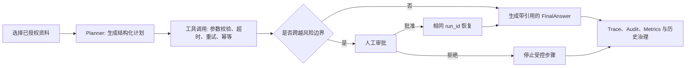

# ResearchOps Agent

[](https://github.com/dafu110/researchops-agent/actions/workflows/ci.yml)
[](LICENSE)

> 我设计并实现了一个可控、可追溯的企业研究 Agent：它让研究结论有证据、工具操作有边界、人工审批可恢复、历史记录可治理。

## 项目概览

面向企业研究流程的参考实现，包含引用式问答、结构化计划、审批恢复、运行追踪与离线评测。

## 界面预览


## 快速开始

先创建本地配置。示例配置默认使用本地演示路径；只有接入外部模型、数据库或 MCP 时才需要替换对应变量。

```powershell
cd <path-to-researchops-agent>
if (-not (Test-Path .env)) { Copy-Item .env.example .env }
```

```powershell
python -m venv .venv
.\.venv\Scripts\Activate.ps1
python -m pip install -e ".[dev]"
python scripts\seed_demo_data.py
python -m uvicorn app.main:app --host 127.0.0.1 --port 8000
```

打开 [http://127.0.0.1:8000/](http://127.0.0.1:8000/)。

## 演示与验证

1. 运行 `python scripts\seed_demo_data.py`；脚本会打印文档、回答、工具调用和审批记录的标识符。
2. 在工作台提问“ResearchOps Agent 支持哪些能力？”，确认回答包含引用。
3. 打开 `GET /api/runs/{run_id}/trace`，检查计划、模型调用、工具状态和审批边界是否可追溯。

完整的求职案例见 [docs/job-search-case-study.md](docs/job-search-case-study.md)，控制和评测契约见 [docs/agent-control-spec.md](docs/agent-control-spec.md)。

关键可验证接口：

- `GET /api/contracts`：当前 Pydantic/JSON Schema 契约。
- `GET /api/runs/{run_id}/trace`：步骤输入、输出、模型、Token、耗时和工具状态。
- `GET /api/runs/{run_id}/tools`：工具调用的超时、重试、幂等键与恢复入口。
- `POST /api/runs/{run_id}/cancel` / `recover`：请求取消或从可恢复失败状态继续。
- `GET /api/metrics`：成功率、P95 时延、工具失败率、人工审批率与有成本样本的单任务成本。

## 核心能力

- 引用式问答与检索证据校验，避免将未经支持的内容作为研究结论。
- 结构化计划、受限工具调用、超时与幂等记录，以及可恢复的人工审批流程。
- 运行 trace、审计记录、指标和 Pydantic/JSON Schema 契约，便于复盘与评测。
- 文档、URL、GitHub 内容导入与异步任务；本地可使用 JSON 回退，生产目标为 PostgreSQL + pgvector。

## 架构与实现



一次运行中，`AskRequest`、`PlanStepDetail`、`ToolCallRecord`、`FinalAnswer` 与 `TraceStep` 均为 Pydantic 契约。每一步保存输入、输出、模型、Token 使用、耗时与错误；工具记录还保存超时、尝试次数、幂等键、取消状态和恢复入口。

## 测试与验证

```powershell
python -m compileall app tests
python scripts\run_eval_gate.py
python scripts\run_agent_self_check.py
```

评测门禁包含 32 条案例，覆盖引用、越权资料、提示注入、高风险工具、审批拒绝/恢复、工具超时、结构化契约与运行指标。

## 部署与生产

Docker Compose 提供 API、Celery worker、PostgreSQL + pgvector 和 Redis 的本地联调环境：

```powershell
docker compose up --build
```

启动前复制 `.env.example` 为 `.env`，并按目标环境替换数据库、模型、认证、MCP 和 sandbox 配置。服务入口为 `http://127.0.0.1:8000/health`。

## 生产边界

- 本地 JSON 回退仅适用于单进程开发；生产持久化必须使用 PostgreSQL + pgvector，并在目标环境完成迁移、并发、备份与恢复演练。当前仓库提供了 schema 与运行接口，但未宣称已完成生产端到端验证。
- MCP 注册表与示例服务器用于本地策略和协议测试；真实第三方 MCP、写入型连接器及其凭证、网络、幂等与故障恢复尚未完成生产验证。
- 本地 Python sandbox 有进程限制；托管环境应启用 Docker 隔离并进行资源与逃逸测试。

## 项目结构

- `app/`：FastAPI 服务、Agent 编排、存储和安全控制。
- `scripts/`：演示数据、评测门禁和自检脚本。
- `tests/`：单元测试与 API smoke 测试。
- `docs/`：架构、案例、控制契约和就绪说明。

## 相关文档与上线准备

- [求职案例](docs/job-search-case-study.md)
- [Agent 控制与评测规范](docs/agent-control-spec.md)
- [闭环自检说明](docs/closed-loop-self-check.md)
- [闭环就绪报告](docs/closed-loop-readiness.md)
- [架构说明](docs/architecture.md)
- [审批边界 ADR](docs/adr/0001-planner-tool-approval-boundary.md)

## 许可证

MIT. See [LICENSE](LICENSE).
