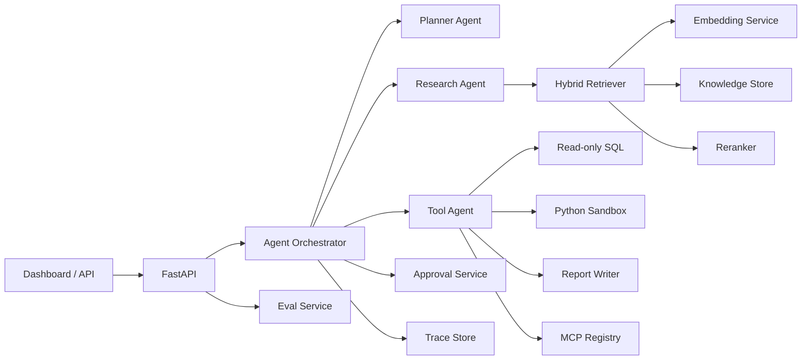

# Architecture

## Goal

ResearchOps Agent turns research work into an auditable workflow:

1. Ingest sources.
2. Retrieve evidence.
3. Answer with citations.
4. Use tools when needed.
5. Pause risky actions for approval.
6. Record trace and eval metrics.

## Components



## RAG

The MVP now uses hybrid retrieval:

- Local or OpenAI embeddings.
- Keyword overlap scoring.
- Weighted semantic + keyword score.
- Reranker score before final top-k selection.
- Citations include document ID, title, locator, and excerpt.

`db/schema.sql` contains a pgvector schema for the production path.

## Agent Runtime

Default mode is `auto`. With `OPENAI_API_KEY`, the Research Agent uses the
OpenAI Agents SDK. Without a key, it uses the deterministic local orchestrator.

```env
AGENT_RUNTIME=auto
```

When enabled, the Research Agent uses the OpenAI Agents SDK with:

- `Agent`
- `Runner`
- `function_tool`

The local path remains available when no API key is configured.

## Permissions

API keys map to a user, role, tenant, and optional source allowlist. Ingested
documents store `tenant_id` in metadata. Retrieval and document listing are
filtered by tenant and source allowlist. Runs, trace access, approvals, and eval
summaries are tenant-scoped.

| Role | Ask | Ingest | Approve |
| --- | --- | --- | --- |
| viewer | yes | no | no |
| editor | yes | yes | no |
| admin | yes | yes | yes |

The API also exposes the runtime permission matrix through
`GET /api/system/config`, so the dashboard can show the effective RBAC surface
instead of hard-coding it in the frontend.

## Tools

Tool Agent supports:

- Calculator.
- Read-only SQLite SQL.
- Restricted Python sandbox with process mode and optional Docker mode.
- Markdown report writer.
- MCP server registry and stdio/HTTP JSON-RPC execution from `MCP_SERVERS_JSON`.

`scripts/example_mcp_server.py` provides a real stdio MCP-style example for
integration testing.

Mutation-style actions are not executed directly. The Planner routes risky
requests to the approval queue.

URL ingestion crosses a network trust boundary. The fetcher rejects non-HTTP
schemes, embedded credentials, private or reserved network addresses, and
unvalidated redirect targets. Deployments can also require a domain allowlist.

## Eval

Golden-set evals check:

- Expected answer terms.
- Citation presence and expected fixture source.
- Approval behavior for unsafe requests.
- Pass rate.
- Citation correctness rate.

The suite seeds each case with a dedicated fixture document, then constrains the
question to that fixture corpus. It covers RAG, tool capability, vector
retrieval, observability, approval safety, missing-context behavior, and sandbox
boundary cases. It is wired into CI as an eval gate.

## Execution Lifecycle

```text
created -> planner -> tool_agent? -> rag_research -> awaiting_approval | completed
```

The trace store persists run metadata with `tenant_id`, `user_id`, question, and
status. This keeps trace timelines auditable and allows tenant-scoped access.
Ask responses include structured planner details for each step: stage, goal,
mode, tool hint, risk level, confidence, and approval/tool requirements.

Long-running UI actions can create task records:

```text
queued -> running -> completed | failed | canceled
```

Text ingestion, URL ingestion, and eval runs are exposed through async API
endpoints with task status records. Celery task functions are available for the
same workload class when Redis workers are enabled. Task records store replay
payloads, attempt counts, retry limits, and cooperative cancellation flags.
Admins can recover stale running tasks after worker interruption.

## Tool Permissions And Audit

Built-in tools have explicit risk levels. Calculator and knowledge stats are
low risk, SQL and sandbox are medium risk, and MCP calls are high risk. Tool
calls write audit records with actor, tenant, run ID, target, risk level, status,
and a short result summary. The audit API supports risk, status, target, and
run filters, and `GET /api/audit/replay/{run_id}` combines trace steps with
matching audit records for a run-level replay view.

Direct MCP tool execution is approval-gated in two places. The planner routes
explicit `mcp call ...` requests to human approval before tool execution, and
the tool execution layer independently blocks any `mcp_call` without an approved
run/action approval record. Blocked attempts are written to audit with
`status=blocked`, so bypass attempts remain visible.

## Deployment Storage

Local development uses `STORE_BACKEND=auto`, which tries PostgreSQL/pgvector and
falls back to the JSON store when PostgreSQL is not reachable. Docker Compose
sets `STORE_BACKEND=postgres` for both the API and worker, making pgvector the
primary deployment path while keeping JSON as the local fallback. In PostgreSQL
mode, knowledge documents/chunks, run traces, approval records, and audit
records are persisted in the database.

## Remaining Production Work

- Persist task records, sessions, and local user management in PostgreSQL.
- Add stricter MCP server/tool allowlists and enforce per-tool approval policies.
- Expand evals with adversarial prompt-injection and tool-failure fixtures.
- Add stronger sandbox isolation defaults for hosted deployments.
