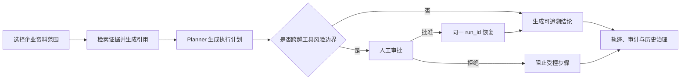

# 求职案例：可控、可追溯的企业研究 Agent

## 一句话定位

我设计并实现了一个可控、可追溯的企业研究 Agent，解决了证据可信、工具风险、人审恢复和历史治理的问题。

它服务于需要基于内部资料做研究、又不能把结论与操作交给黑盒流程的团队。产品不是把“能回答问题”当作终点，而是让每一次研究都能回答四个问题：证据来自哪里、工具是否越界、人工如何接管、历史如何被治理。

## 问题与目标

普通 RAG Demo 解决的是“找得到内容”，但企业研究还需要处理以下风险：

| 用户问题 | 产品目标 | 对应能力 |
| --- | --- | --- |
| 这条结论根据什么得出？ | 可核验 | 资料范围、引用、定位信息、运行记录 |
| Agent 调工具会不会误操作？ | 可控 | 计划层识别风险、工具层再次校验、审批门禁 |
| 审批后原任务还能接着做吗？ | 可恢复 | 在原 `run_id` 上恢复原问题、资料范围与计划 |
| 历史研究能否删除且保留治理证据？ | 可治理 | 管理员删除内容，保留不含研究内容的删除审计 |

## 核心闭环

## 关键设计决策

### 1. 用受限资料与引用解决证据可信

研究请求可选择特定文档范围；检索只在授权租户和允许来源内进行。回答返回文档、标题、定位信息与摘录，前端将其与回答和运行记录一起保存。这样用户不需要相信模型“看过资料”，而是可以回到具体证据复核。

### 2. 风险判断不只放在 Planner

Planner 在任务开始前识别高风险、破坏性或外部委托意图并创建审批。工具执行层仍按工具策略独立检查，例如 MCP 调用即使绕过了计划层，也不会在没有有效审批时执行，并写入被阻止的审计事件。两个边界避免把安全完全押在一次意图分类上。

### 3. 审批后恢复同一条运行

审批不是一个终点。批准后，管理员显式点击“继续运行”，系统复用原问题、资料范围、引用要求和计划，在相同 `run_id` 上写入 `approval_resumed` 轨迹步骤。它避免了重新提问导致的上下文漂移，也避免了“批准即静默执行”的不可见状态变化。

### 4. 删除研究内容，但不删除治理事实

管理员可以删除一条研究的回答、引用、轨迹、审批和详细审计内容；之后该运行的轨迹与回放接口返回 `404`。系统只保留一条不含问题、答案或引用的 `delete_run` 审计记录，以满足治理可追溯与内容最小化之间的平衡。

### 5. 本地可演示，生产有明确边界

项目支持 JSON 本地回退并使用原子写入与损坏恢复，方便单进程演示。生产路径使用 PostgreSQL + pgvector、Celery + Redis；JSON 回退不被描述为多实例方案。这一取舍将“能跑 Demo”和“可部署”明确分开。

## 三分钟演示路径

1. 运行 `python scripts\seed_demo_data.py`，启动服务，进入研究工作台。
2. 在“资料”接入或选择一份资料，在输入框提问“请基于资料库说明研究结论如何做到可追溯，并给出引用。”展示资料范围、引用与运行计划。
3. 使用“执行受控工具”示例，展示工具步骤、风险等级和运行轨迹。
4. 使用“体验人工审批”示例。请求会暂停，不会执行破坏性操作。
5. 以管理员身份在“治理”批准请求，点击“继续运行”，确认相同 `run_id` 出现 `approval_resumed`。
6. 从回答的“查看运行证据与操作记录”打开轨迹、工具审计与审批记录。
7. 管理员删除一条演示研究，说明内容被清除、运行详情变为 `404`，但保留无内容的删除审计。

## 验证证据

- 评测门禁覆盖 32 项能力，包含提示注入、越权资料、审批拒绝/恢复与工具超时；发布门槛为 `pass_rate >= 0.90`、`citation_correctness >= 0.95`。
- API 回归覆盖资料接入、风险请求、审批、同一运行恢复、来源范围保持、删除后 `404`、文档删除及 viewer/editor/admin 权限矩阵。
- Python 编译、静态界面连线检查与 `git diff --check` 已通过。
- 完整检查命令见 [README](../README.md#quality-gates)；生产环境还应运行 PostgreSQL 存储校验。

## 面试讲解重点

**Agent 工程师角度：** 我把 Agent 设计成显式状态机而不是单次 LLM 调用。状态、输入范围、计划、审批和工具审计都能持久化；策略在 Planner 与工具层双重执行；评测门禁把引用正确性和安全行为变成可回归的质量指标。

**Agent 产品经理角度：** 我没有把所有后台能力堆到首页，而是按“研究、资料、治理”分层。研究用户先得到结论和证据，治理能力在需要时展开；审批不是通知，而是可理解、可决策、可恢复的工作流；删除功能兼顾用户的数据控制权与组织的治理证据。

## 已知边界与下一步

- JSON 回退仅适合本地、单进程开发；多实例部署必须强制 PostgreSQL。
- 需要增加真实第三方 MCP 的端到端沙箱 fixture，以及更多特定行业的对抗性评测数据。
- 任务、会话和本地用户管理仍应完整迁移到 PostgreSQL，形成统一的生产级持久化边界。
